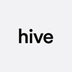

# Project Guidelines
- [Git](#git)
- [Documentation](#documentation)
- [Environments](#environments)
- [Dev Environment](#dev)
- [Dependencies](#dependencies)
- [Testing](#testing)
- [Structure and Naming](#structure)
- [Code style](#code_style)
- [Logging](#logging)
- [Licensing](#licensing)

## <a id="git"></a>1. Git
* We use GitFlow, read more here [A successful Git branching model » nvie.com](http://nvie.com/posts/a-successful-git-branching-model/)
* Resolve potential conflicts before making a Pull Request
* Never Push into `develop` branch.
* Keep your `develop` and  `master` update.
* Make a Pull Requests to develop only if your build have been successful on your machine (this includes passing tests and [code style](#code style) checks )
* Merge your pull requests only after receiving approval from at least one of your team members.
* Use [hive’s .gitignore file](./README.sample.md).
* Make sure your `.gitignore` exclude the following from Repo
	* `.env` or any file containing passwords, keys, tokens or anything similar used in production
	* Your editor config files (.idea, .vscode etc…)
	* Any generated file (compiled sources, build outputs, logs)
	* You dependencies directory (node_modules, bower_components etc…)
	* OS folder view configuration (.DS_STORE, Desktop.ini etc…)
	* Thumbnail cache files (._*,  Thumbs.db etc…)

## <a id="documentation"></a>2. Documentation
* Follow hive’s  `README.md` template for start (add extra sections if necessary). [hive’s README.md template](./README.sample.md)
* If project is broken down into more than one repo, provide links in the  `README.md` file.
* Keep `README.md` updated
* Comment all your code to make it as clear as possible how your app works, and what you are intending with each major section. 
* Update your comments

## <a id="environments"></a>3. Environmental Awareness
* Depending on project size, define separate `development`, `test` and `production`  environments. 
* Load your deployment specific configurations from environment variables and never add them to the codebase as constants, [look at this sample](./config.sample.js).
*  Your config should be correctly separated from the apps internals if the codebase could be made public at any moment.  Use `.env` files to store your variables and add them to `gitignore` to be excluded from your code base because of course, you want the environment to provide them. Instead commit a `.env.example`  which serves as a guide for developers to know which environment variables the project needs. It is important to remember that this setup should only be used for development. For production you should still set your environment variables in the standard way.
* It’s recommended to validate environment variables before your app starts ,  [look at this sample](./configWithTest.sample.js) using `joi` to validate provided values: 

## <a id="dev"></a>4. Dev Environment
### 4.1 Consistent dev environments:
* Use `engines` in `package.json` to specify the version of node that your stuff works on.
* Use `nvm` and create a  `.nvmrc`  in your project root.  Mention in documentation
* Use a `preinstall` script that checks node and npm versions
* Or if it doesn’t make things complicated use a docker images 
* Local modules instead of requiring global installation

### 4.2 Consistent dependencies:
* Use `package-lock.json` on npm 5 and later
* For older versions of npm Use `—save --save-exact` when installing a new dependency and create `npm-shrinkwrap.json` before publishing.
* If you use `Yarn` make sure to mention it in `README.md`. Your lock file and `package.json` should have the same versions after each dependency upgrade.
* Read more [package-locks | npm Documentation](https://docs.npmjs.com/files/package-locks)

## <a id="dependencies"></a>5. Dependencies
Before using a package check its Github open issues, daily downloads and number of contributors as well as the date package last updated.
If less known dependency is needed,  discuss it with the team before using it.

* Which packages am I using? And for each one... [ls | npm Documentation](https://docs.npmjs.com/cli/ls)
* Am I still using this package?[depcheck](https://www.npmjs.com/package/depcheck) Always get rid of unused packages
* Are other developers using this package? [npm-stat: download statistics for NPM packages](https://npm-stat.com/)
* Am I using the latest version of this package? [outdated | npm Documentation](https://docs.npmjs.com/cli/outdated)
* When was this package last updated? [view | npm Documentation](https://docs.npmjs.com/cli/view)
* How many maintainers do these packages have? [view | npm Documentation](https://docs.npmjs.com/cli/view)
* Does this package have known security vulnerabilities? [Test | Snyk](https://snyk.io/test?utm_source=risingstack_blog)

## <a id="testing"></a>6. Testing
* Have a test mode environment if needed.
* Place your test files next to the tested modules using `*.test.js` or `*.spec.js` naming convention, like `module_name.spec.js`
* Put your additional test files to a separate test folder to avoid confusion.
* write testable code, avoid side effect, extract side effects, write pure functions
* Don’t write too many tests to check types, instead use a Static type checker
* Run tests locally before any pull request to `develop`.

## <a id="structure"></a>7. Structure and Naming
* Organise your files around product features / pages / components, not Roles:

```
// BAD 
.
├── controllers
|   ├── product.js
|   └── user.js
├── models
|   ├── product.js
|   └── user.js
```

```
// GOOD
.
├── product
|   ├── index.js
|   ├── product.js
|   └── product.test.js
├── user
|   ├── index.js
|   ├── user.js
|   └── user.test.js
```

* Place Your Test Files Next to The Implementation
* Put your additional test files to a separate test folder to avoid confusion.
* Use a `./config` directory
* Put Your Long `npm` Scripts in a `./scripts` directory. This is for bash and node scripts for database synchronisation, front-end build scripts and so on. 
* Put your compiled or built output in a `./build` folder
* Use `PascalCase/camelCase` for filenames and directory names too. Which  `PascalCase`  is for Components.
* `CheckBox/index.js` should have the `CheckBox` component, as could `CheckBox.js`, but **not** `CheckBox/CheckBox.js` or `checkbox/CheckBox.js`
* Ideally the directory name would match the name of the default export of `index.js`

## <a id="code_style"></a>8. Code style
* Use latest stablished JavaScript syntax for new projects
* Include code style check before build process
* Use [ESLint - Pluggable JavaScript linter](http://eslint.org/) to enforce code style
* Use [Airbnb JavaScript Style Guide](https://github.com/airbnb/javascript) for JavaScript.  [Read more · GitBook](https://www.gitbook.com/book/duk/airbnb-javascript-guidelines/details) 
* Use [Flow type linting rules for ESLint.](https://github.com/gajus/eslint-plugin-flowtype) for [FlowType](https://flow.org/)
* Use `.eslintignore` to exclude file or folders from linting. 
* Remove your `eslint` disable comments before making a Pull Request
* Always use  `//todo:`  comments to remind yourself and others about an unfinished job
* Always comment and keep them relevant as code changes 
* Remove commented block of code when possible
* Avoid console logs on client side code in production
* Avoid alerts in production
* Avoid irrelevant or funny comments, logs or naming.
* Write testable code, avoid side effect, extract side effects, write pure functions
* Make your names searchable with meaningful distinctions avoid shortened names. For functions Use long, descriptive names. A function name should be a verb or a verb phrase, and it needs to communicate its intention
* Organise your functions in a file according to the stepdown rule. Higher level functions should be on top and lower levels below. It makes it natural to read the source code.

## <a id="logging"></a>9. Logging
* Avoid client side console logs in production
* Produce readable production logging. Ideally use production logging libraries to be used in production mode.

## <a id="licensing"></a>10. Licensing
Make sure you use resources that you have the rights to use. Copyrighted images and videos, for example, could cause legal problems.


---
Sources:
[RisingStack Engineering](https://blog.risingstack.com/), 
[Mozilla Developer Network](https://developer.mozilla.org/), 
[Heroku Dev Center](https://devcenter.heroku.com), 
[airbnb/javascript](https://github.com/airbnb/javascript)


© WeAreHive Limited